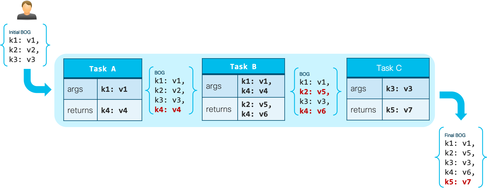
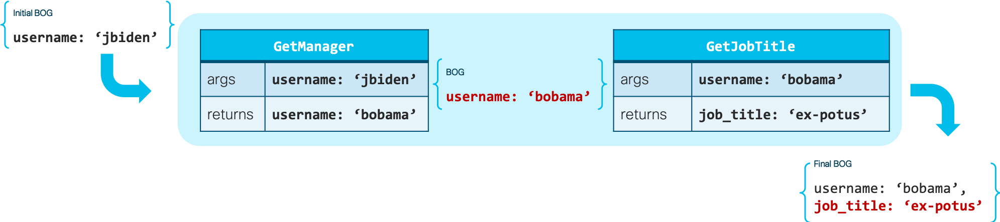

.. _intro:

=============
Introduction
=============

FireX Kit provides:

  * A ``FireXTask`` class derived from Celery's base `Task`_ class that facilitates passing of arguments and return values from one task to another, which is particularly useful when using `Chains`_.
  * A mechanism to elegantly and dynamically convert task arguments.
  * Helper functions that faciliate checking for readiness of AsyncResult objects.

.. _`Task`: http://docs.celeryproject.org/en/latest/userguide/tasks.html
.. _`Chains`: http://docs.celeryproject.org/en/latest/userguide/canvas.html#chains

Argument Passing made easy
---------------------------
FireX Kit uses a simple concept called Bag Of Goodies (BOG), which can be visualized as a dictionary of argument/value pairs from which a  task can pick the subset of arguments it requires, and might choose to update the BOG with returned key/value pairs. This dynamic dictionary then moves to the next task in the chain, which will in turn can consume some of the arguments it requires, as well as optionally add or update the BOG with its returns.

Consider a chain comprised of `Task A`, `Task B`, and `Task C`. If these tasks derives from ``FireXTask`` class, the arguments and return values will flow as depicted in the following diagram:

In the above example:

* The user invokes a chain `Task A` | `Task B` | `Task C`, providing arguments `k1`, `k2` and `k3`, with values `v1`, `v2`, and `v3` respectively (i.e., the initial BOG).
* `Task A` will only consume `k1: v1` from the Initial BOG. It will then add to the BOG its own returns, i.e., `k4: v4`.
* `Task B` will consume `k1: v1` provided initially by the user, as well as `k4: v4` which was returned by the preceeding `Task A`.
* `Task C` consumes `k3: v3`, but also adds its returns `k5: v7` to the BOG.

Few things are noteworthy:

* A ``FireXTask`` like `Task A`, `Task B`, and `Task C` does not need to consume `**kwargs` in order to enable it to consume extra arguments that it doesn't need. For example, `Task A`'s signature contains only `k1`.
* There is only one BOG in a given chain, so, if a task in the chain returns the same key as an element that already exists in the BOG, the original value of that key will be replaced, as was the case with `k4` update by `Task B` in the example above.

Below is another simple example of two ``FireXTask`` tasks:

